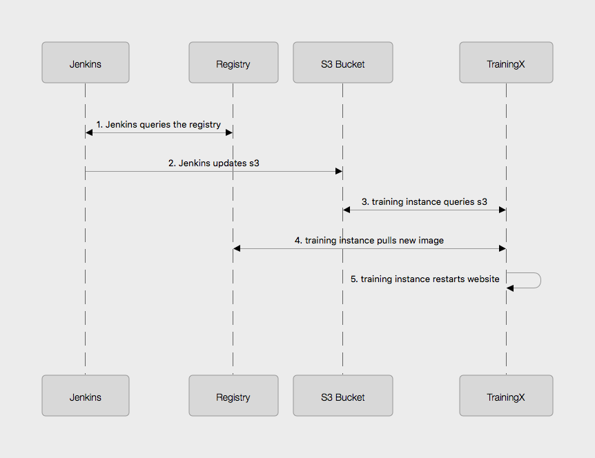
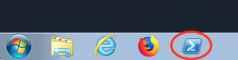
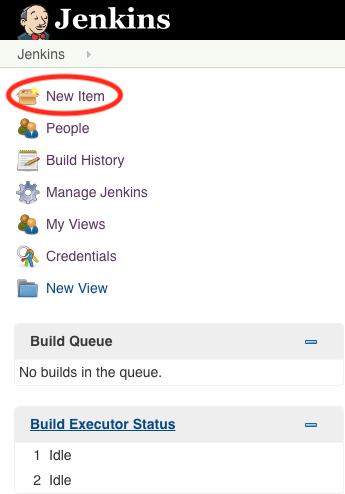
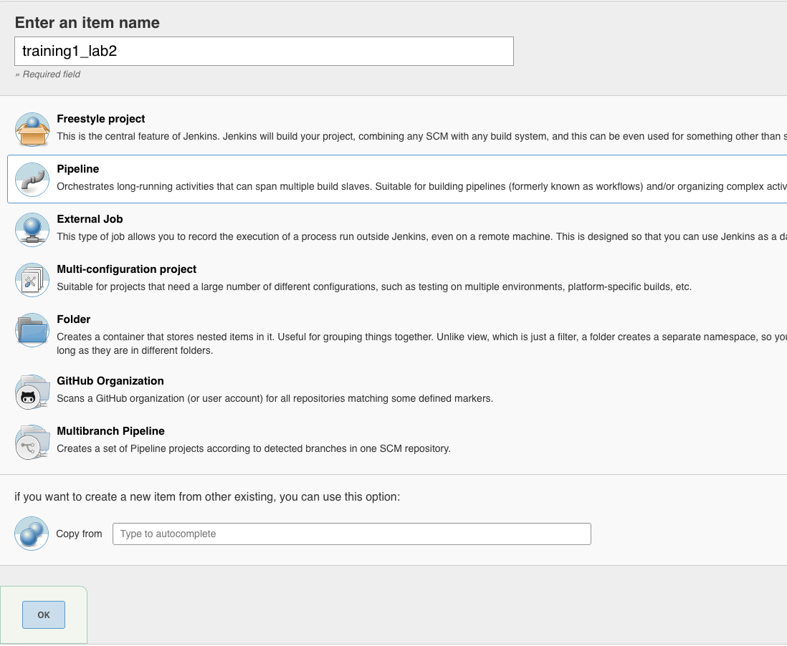
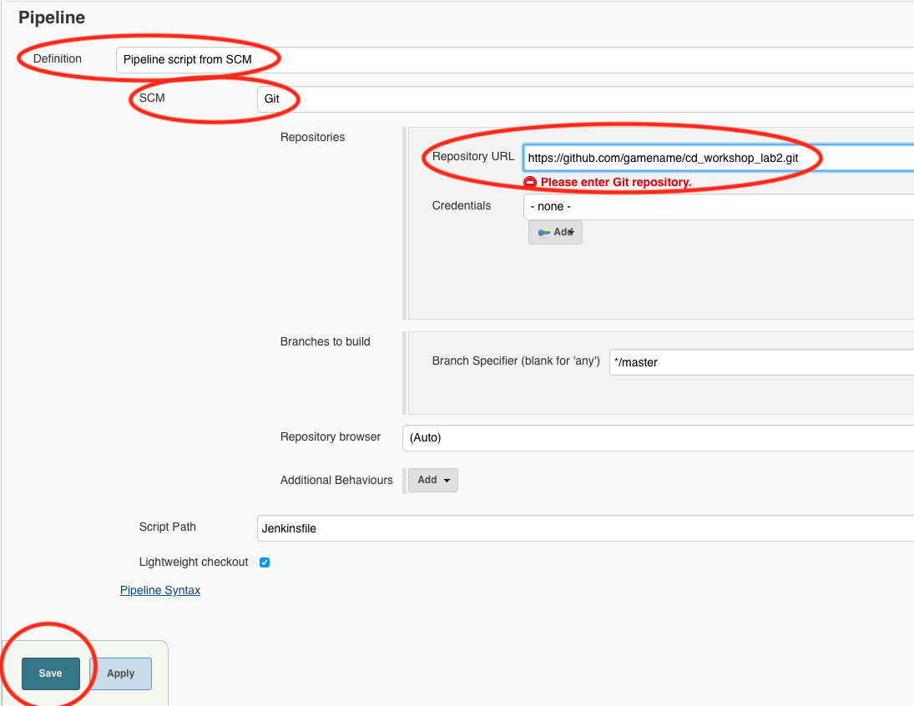
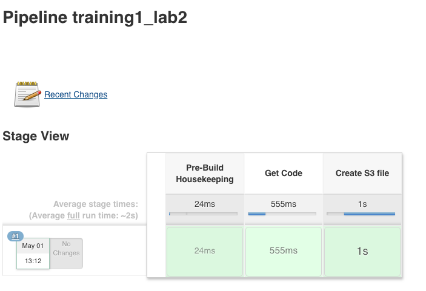
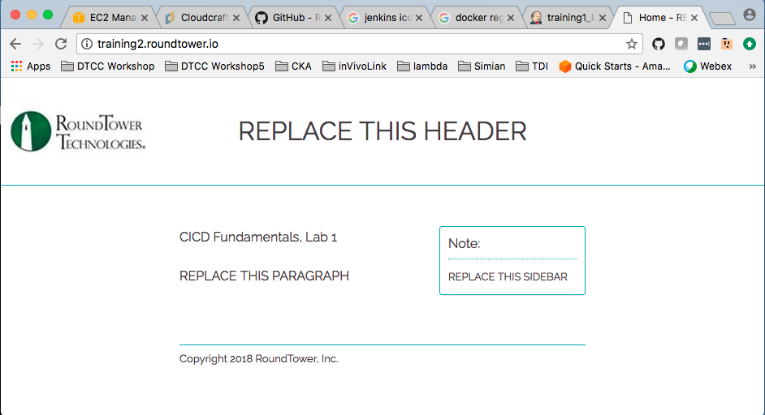
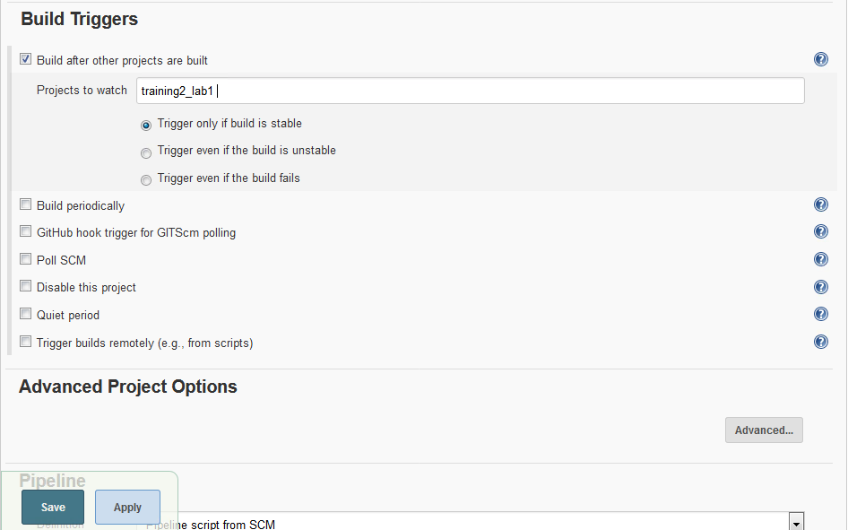

= Continuous Delivery: Lab 2
Tennis Smith <tennis@roundtower.com>
1.0
:toc:
:http://icons[icons][]: font
:quick-uri: http://www.roundtower.com

== Prerequisites
// tag::prerequisites[]
Students will need a computer with:

* An Amazon Workspaces login (see your instructor for details)

// end::prerequisites[]

== Lab 2
// tag::procedure[]

Lab2 will extract the tag of the latest docker image (1 below) in the registry
and then stage it to an s3 bucket (2 below). On each instance, there is a
cron job that will read the s3 bucket once per minute (3 below).  If the tag
in the bucket is newer than the currently-running website, then the instance
will pull an image from the registry (4 below). Then, the training instance will restart
the website with the new docker image (5 below). The idea is to provide a way
for Jenkins to control when a training instance updates to a new version of the
website.

=== Step 1: Login to GitHub
* In your workspaces session, open a web browser and login to github: http://github.com

TIP: If you don't have a GitHub account, go to http://github.com and create a free account

=== Step 2: Fork the lab2 repo
* Go to this url: https://github.com/RoundTower-io/cd_workshop_lab2

* Fork the repo by clicking on the "Fork" button in the upper right of the screen.

* This will create a copy of the lab2 repo under your own GitHub id

=== Step 3: Clone a copy of the lab2 repo
* In your workspace session, open a new terminal window by clicking on the Powershell icon.

* Make a local copy of the repo by cloning it with the following command

[source]
git clone https://github.com/<your user name>/cd_workshop_lab2.git

=== Step 4: Update the Jenkinsfile
* Go to the home directory of your new repo
[source]
cd cd_workshop_lab2

* Now edit the file `Jenkinsfile`
[source]
atom Jenkinsfile

* Change every occurrence of `training99` to your training ID (assigned by the instructor).

* Save and exit the file

=== Step 5:  Commit Changes and Push to Central Repository

* First, change the working directory.

[source]
cd ~/cd_workshop_lab2

* Next, add all altered files to the change set.

[source]
git add .

* Next, commit the changes.

[source]
git commit -m "Updated Jenkinsfile"

* Last, push the change to GitHub.

[source]
git push

=== Step 6: Setup a Jenkins pipeline

* Login to Jenkins at http://jenkins.roundtower.io

* Login using your assigned training id (get it from your instructor).

* Click on the "New Item" option on the main menu

* Name your new pipeline `<your training id>_lab2` and select `pipeline` as the type. Then click `ok` to save it.

* At the bottom of the page, set the `Definition` field to `Pipeline script from SCM`, then set the `SCM` field to `Git`. Put your lab2 url in the `Repository URL` field. Finally, click on `Save` to save all your work.

* Click `Build Now` on the upper left of the screen.

* After the build, click on your `trainingX_lab2` link on the dashboard. You should see output something like this:

=== Step 7: Access website

* Go to the following URL based on your training ID number, http://trainingX.roundtower.io.  For example, if you are assigned
`training1`, then the url would be http://training1.roundtower.io

* You should see something like this

=== Step 8: Trigger lab2 build on completion of lab1 build

* Click on `trainingX_lab2` on the main dashboard.

* Now click on `Configure` on the left side of the screen. This will take you back
to the configuration options for lab2's pipeline

* Scroll down to `Build Triggers` and click on `Build after other projects are built`
(it is the first option in the list).

* In the `Projects to watch` field, put in the name of your lab1 pipeline.  For
example, if your training ID is `training2`, then the lab1 pipelne will be named
`training2_lab1`. Make sure that `Trigger only if build is stable` is selected
too.

* Click on `Save` and exit the configuration.

* From now on, lab2 will build *only if* your lab1 pipeline builds successfully.

// end::procedure[]

//
//
//
//
//  RESOURCE SNIPS - NOTHING BELOW HERE WILL BE RENDERED
//
// [source]
// $ brew install asciidoc
//
// ====
// _This is an italicized admonition_
// ====
//
// TIP:  Don’t eat the yellow snow.
//
// WARNING:  Weasels are bitey.
//
// ====
// *This is something you _REALLY_ should know*
// ====
//
